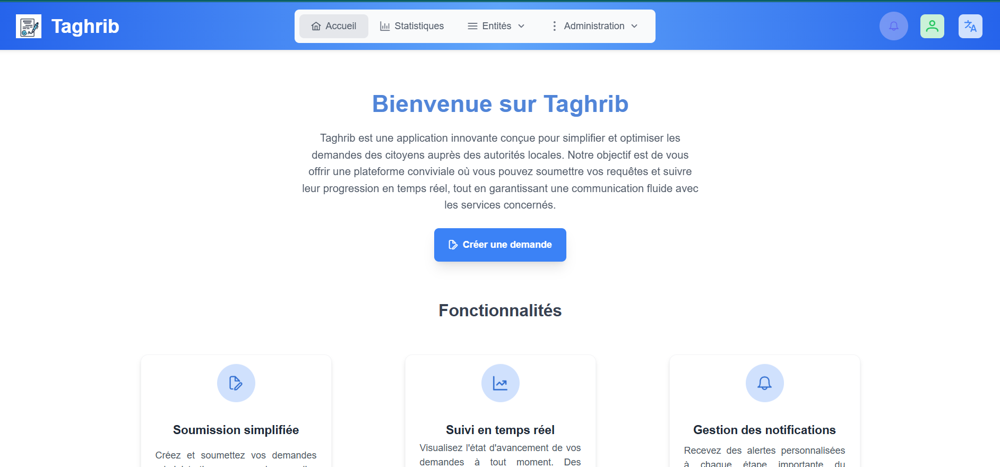
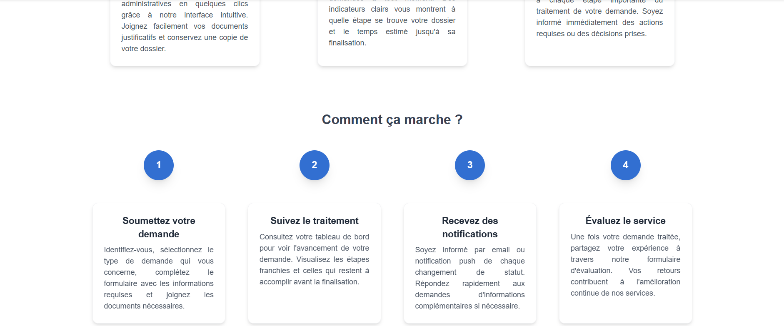
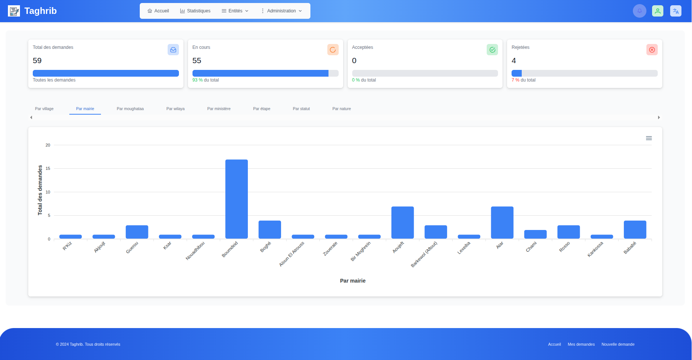

# Taghrib Project 🚀

**Taghrib** is a digital initiative designed to modernize, secure, and centralize administrative exchanges between citizens, local authorities, and the Ministry of the Interior. The project focuses on streamlining administrative processes, improving transparency, and providing real-time tracking of citizen requests.

---

  
  
  

---

## 📊 Dashboard Overview

The Taghrib platform provides a **dynamic statistical dashboard** for authorized users (local and central authorities) according to their hierarchical level:

- **Mayor:** Statistics by village, status, stage, type of request  
- **Hakem:** Same as Mayor, plus view of villages in their moughataa  
- **Wali:** Adds view of moughataas under their jurisdiction  
- **Ministry of Interior & officials:** Global statistics by village, mayor, moughataa, wilaya, ministry, etc.  
- **Administrator:** Full access to all statistics  

At the top of the dashboard, **summary cards** display key indicators such as total requests, number and percentage of requests in progress, accepted, or rejected. Data dynamically adapts based on each user’s permissions and responsibilities.

---

## Table of Contents

- [Objectives](#objectives)
- [Problems Solved](#problems-solved)
- [Technologies Used](#technologies-used)
- [Audience](#audience)
- [Note on Code Availability](#note-on-code-availability)

---

## Objectives 🎯

The **main goal** of Taghrib is to develop a secure digital platform for managing citizen requests. Specific objectives include:

- **Simplifying citizen interactions:** Provide an intuitive web and mobile interface for citizens to submit requests quickly.
- **Real-time tracking:** Allow users to follow the progress of their requests with detailed history.
- **Transparent communication:** Enable seamless interactions between citizens and local authorities.
- **Improving public service efficiency:** Automate request management to reduce processing times and enhance responsiveness.
- **Data-driven decision-making:** Generate statistics and reports for authorities to assess service performance.

---

## Problems Solved 🛠️

Taghrib addresses several challenges in the current administrative process:

- **Slow and inefficient processes:** Traditional paper-based or phone-based requests lead to long delays.
- **Lack of transparency:** Citizens often cannot track the status of their requests.
- **Limited communication:** Information exchange between citizens and authorities is fragmented.
- **Document mismanagement:** Physical documents are prone to loss or misplacement.
- **No centralized data:** Authorities lack tools to analyze request volumes and performance.

**Benefits:**
- Traceability and equity for all citizens.
- Reduced processing times and costs.
- Centralized data for analytics and decision-making.

---

## Technologies Used 💻

**Front-end Web:**  
- Developed with **Angular** + **PrimeNG**, **TailwindCSS**, **NgBootstrap**  
- Responsive, modern UI for citizens and agents  

**Front-end Mobile:**  
- Developed with **FlutterFlow** for Android/iOS  
- Connects to backend via REST APIs  

**Back-end:**  
- Developed with **Spring Boot**  
- Handles business logic, user management, security  
- Exposes RESTful APIs for web and mobile  

**Database:**  
- **PostgreSQL** for structured data storage (requests, users, roles, statuses, histories)  

**Technologies & Frameworks Badges:**  

  
  
  
  
  
  

---

## Audience 👥

- **Citizens:** Submit requests, attach documents, track status, and communicate with authorities.  
- **Local authorities and administrators:** Manage requests, assign tasks, update statuses, and notify citizens.  
- **Technical services:** Handle assigned requests and confirm completion.

---

## Note on Code Availability ⚠️

The code for Taghrib is **private** and cannot be publicly released, as it was developed by [**Richatt**](https://richatt.com) for the [**Ministry of the Interior**](https://www.interieur.gov.mr/fr/node/26).

---

*Taghrib is a solution aimed at modernizing administrative services, ensuring transparency, and improving citizen satisfaction.*
